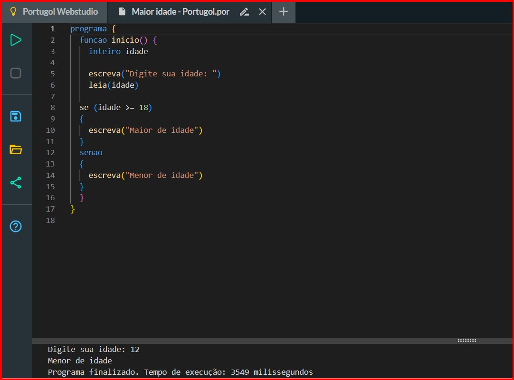
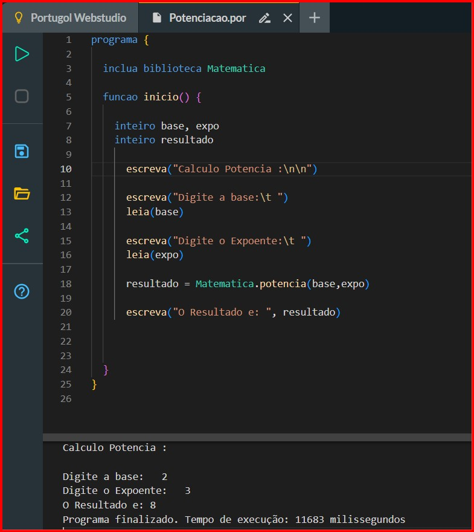

# logica-programacao-portugol

# Lógica de Programação e Algoritmos: Fundamentos de Gestão de TI

Este repositório consolida as práticas de lógica estruturada desenvolvidas durante o curso de Gestão de Tecnologia da Informação. O objetivo é demonstrar a capacidade de transpor problemas de negócio para soluções computacionais utilizando pseudocódigo.

## 🎯 Objetivos do Projeto
* Desenvolver o raciocínio lógico e estruturado.
* Implementar estruturas condicionais e de repetição.
* Validar algoritmos através de testes de mesa e execução no **Portugol WebStudio**.

## 🛠️ Tecnologias e Ferramentas
* **Linguagem:** Portugol (Pseudocódigo).
* **Ambiente:** Portugol WebStudio.
* **Bibliotecas:** `Matematica` (utilizada para cálculos de potência).

## 📚 Documentação de Conceitos Técnicos

Diferente de um simples código, este projeto explora fundamentos da ciência da computação aplicados à gestão:

### ⚡ Estruturas Condicionais (se/senao)
* **Aplicação:** Utilizada no Algoritmo de Maioridade.
* **Lógica:** Permite que o sistema tome decisões automáticas com base em dados de entrada. É o fundamento para regras de negócio e validação de processos em qualquer sistema de TI.

### 🔄 Estruturas de Repetição e Bibliotecas
* **Aplicação:** Utilizada no Algoritmo de Potenciação.
* **Lógica:** Demonstra a capacidade de realizar cálculos complexos ($a^b$) de forma eficiente. O uso da biblioteca `Matematica` mostra o entendimento sobre reaproveitamento de código e módulos pré-existentes.

## 📊 Resultados e Validação

Abaixo, as evidências da execução correta dos algoritmos desenvolvidos:

### Verificação de Idade

### Cálculo de Potência

## 🏁 Conclusão e Visão de Gestão

Dominar a lógica de programação é o primeiro passo para um Gestor de TI que deseja atuar com **Análise de Dados e BI**. A capacidade de estruturar um algoritmo para resolver um problema matemático é a mesma necessária para criar métricas de negócio complexas ou automações de processos.

Este projeto reforça a minha transição de carreira, provando que a experiência operacional pode ser potencializada com o rigor técnico da programação.

---

## 🧭 Navegação Completa pelo Portfólio

Confira os meus outros projetos técnicos desenvolvidos durante a graduação em Gestão de TI:

* 🏠 [**Voltar ao Perfil Principal**](https://github.com/cezarscarvalho)
* 🐧 [**Sistemas Operacionais** (Linux & VirtualBox)](https://github.com/cezarscarvalho/sistemas-operacionais-linux)
* 📐 [**Lógica e Processos** (Fluxogramas)](https://github.com/cezarscarvalho/logica-fluxograma-processos)
* 🗄️ [**Modelagem de Dados** (MySQL & DER)](https://github.com/cezarscarvalho/modelagem-dados-mysql-biblioteca)
* 🌐 [**Redes de Computadores** (Cisco Packet Tracer)](https://github.com/cezarscarvalho/projeto-cisco-packet-tracer)

## 📂 Conteúdo Adicional
O relatório acadêmico completo, com a fundamentação teórica e as conclusões, pode ser consultado na pasta `/docs`. [Visualizar Relatório Acadêmico](https://github.com/cezarscarvalho/logica-programacao-portugol/blob/main/docs/Relat%C3%B3rio%20Acad%C3%AAmico%20-%20Algoritmos%20e%20Programa%C3%A7%C3%A3o%20Estruturada.doc.pdf)

## ✉️ Contato

  
  

>
